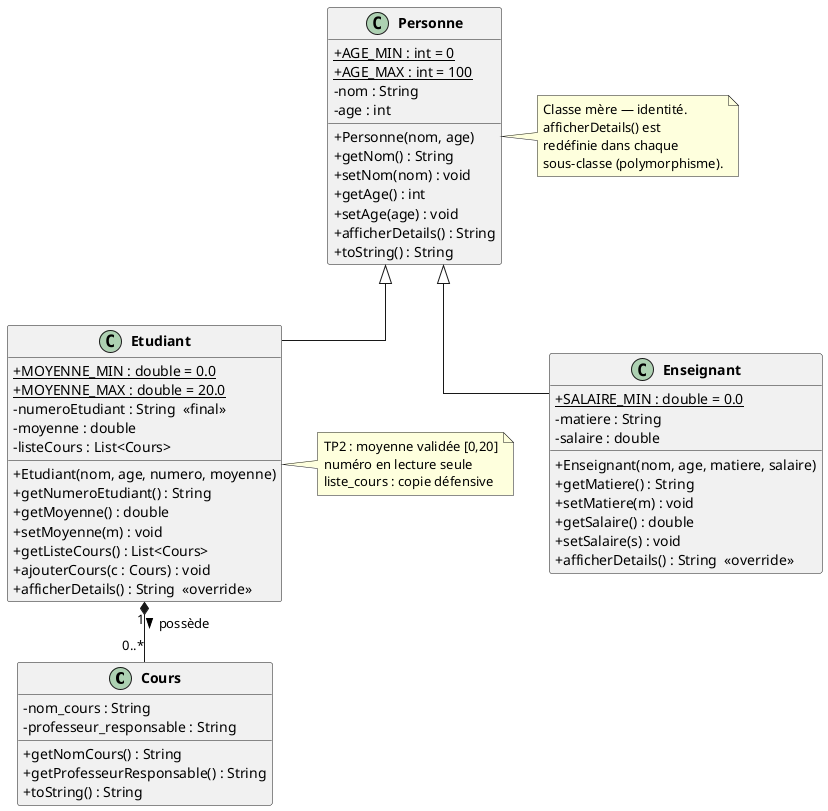

# Diagramme UML — Gestion Étudiante

## Diagramme de classes (PlantUML)

À coller dans [PlantUML Online](https://www.plantuml.com/plantuml/uml/) ou à compiler avec `plantuml uml.puml`.

## Relations

- **Héritage** : `Etudiant` et `Enseignant` héritent de `Personne` (relation *est-un*).
- **Composition** : `Etudiant` possède 0..N `Cours` (relation *a-un*).
- **Polymorphisme** : `afficherDetails()` définie dans `Personne`, redéfinie dans `Etudiant` et `Enseignant`.

## Respect SOLID

| Principe | Application |
| --- | --- |
| **S** | Chaque classe = 1 responsabilité (identité, cours, rôle pédagogique). |
| **O** | Ajouter un `Doctorant extends Etudiant` → aucune modification du code existant. |
| **L** | `Etudiant`/`Enseignant` substituables à `Personne` sans casser le contrat. |
| **I** | Pas d'interface fourre-tout ; on pourrait introduire `IAffichable` sans impact. |
| **D** | Les dépendances concrètes (persistance, notifications) sont absentes du domaine — prêt pour injection. |
